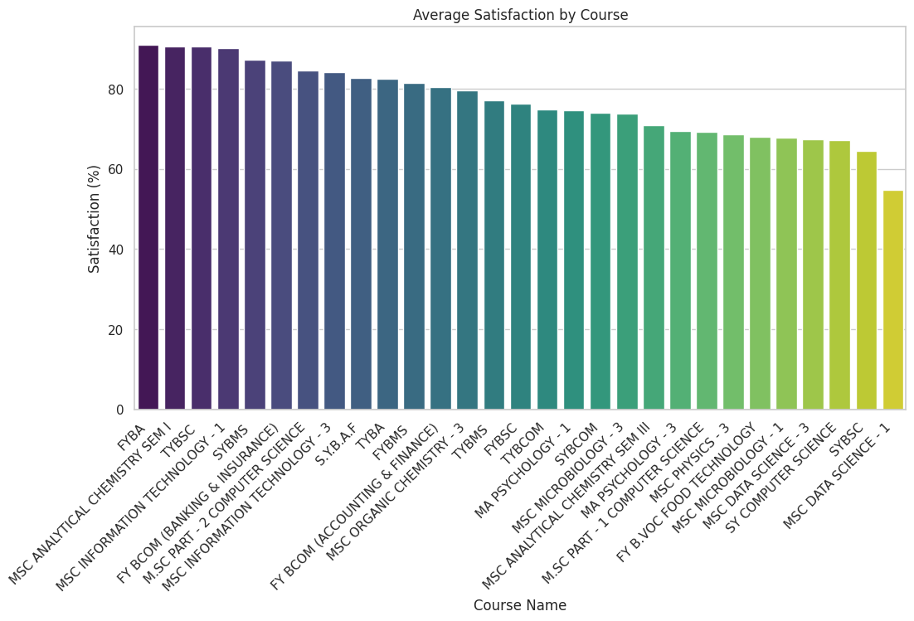
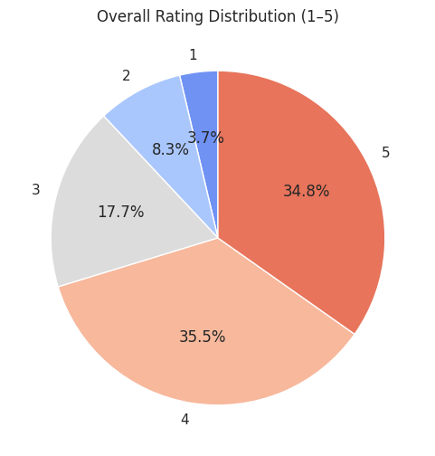
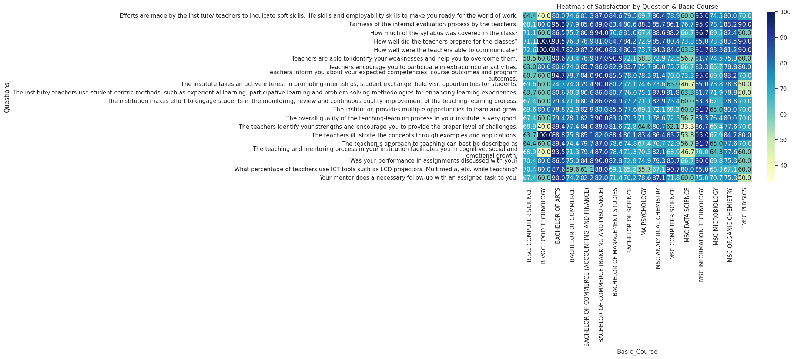

# FUTURE_DS_03 – College Event Feedback Analysis

## 📌 Objective
The goal of this project is to analyze **student satisfaction survey data** collected from multiple courses during college events.  
We measure feedback trends, identify satisfaction levels, and suggest improvements for future academic and co-curricular activities.

---

## 🛠️ Tools & Libraries
- **Python** (pandas, matplotlib, seaborn)  
- **Google Colab / Jupyter Notebook**  
- **CSV Dataset** (Student Satisfaction Survey from Google Forms)  

---

## 🔎 Process
1. **Data Cleaning**
   - Standardized column names.  
   - Converted weightages (`Weightage 1–5`) into numeric form.  
   - Derived a new metric `Satisfaction_%` using weighted average formula.

2. **Satisfaction Score Calculation**
   - Formula:  
     \[
     Satisfaction\% = \frac{(1×W1 + 2×W2 + 3×W3 + 4×W4 + 5×W5)}{Total\ Feedback\ Given × 5} × 100
     \]

3. **Analysis Performed**
   - Overall student satisfaction across all courses.  
   - Average satisfaction per **course**.  
   - Average satisfaction per **basic course stream** (e.g., B.Sc, B.Com, M.Sc).  
   - Identification of **highest** and **lowest** rated courses.

4. **Visualization**
   - 📊 **Bar Chart** → Average satisfaction by course.  
   - 🥧 **Pie Chart** → Overall distribution of ratings (1–5).  
   - 🔥 **Heatmap** → Satisfaction trends across questions vs. course streams.

---

## 📊 Results
- **Overall Student Satisfaction:** ~ **76.86%**  
- **Highest Rated Course:** **FYBA** – **91.00%**  
- **Lowest Rated Course:** **MSC DATA SCIENCE** – **54.67%**  

---

## 📸 Results (Visualizations)

### Average Satisfaction by Course

### Overall Rating Distribution

### Heatmap of Satisfaction

---

## 💡 Insights & Recommendations
- Overall satisfaction is strong at **76.86%**, indicating students are largely satisfied.  
- **FYBA** stood out with the **highest rating (91%)**, showing strong student approval.  
- **MSC Data Science** recorded the **lowest satisfaction (54.67%)**, suggesting a need to improve teaching methods, course design, or event engagement in that stream.  
- Continuous monitoring of student feedback will help maintain high satisfaction and address weaker areas effectively.  

---

## 📂 Repository Structure
FUTURE_DS_03/
│── README.md
│── Student_Satisfaction_Survey.csv # Raw dataset (optional, if sharable)
│── Student_Satisfaction_Cleaned.csv # Processed dataset with Satisfaction_%
│── task3.ipynb # Jupyter/Colab notebook
│── plots_avg_satisfaction_by_course.png # Bar chart
│── plots_rating_distribution.png # Pie chart
│── plots_satisfaction_heatmap.png # Heatmap
